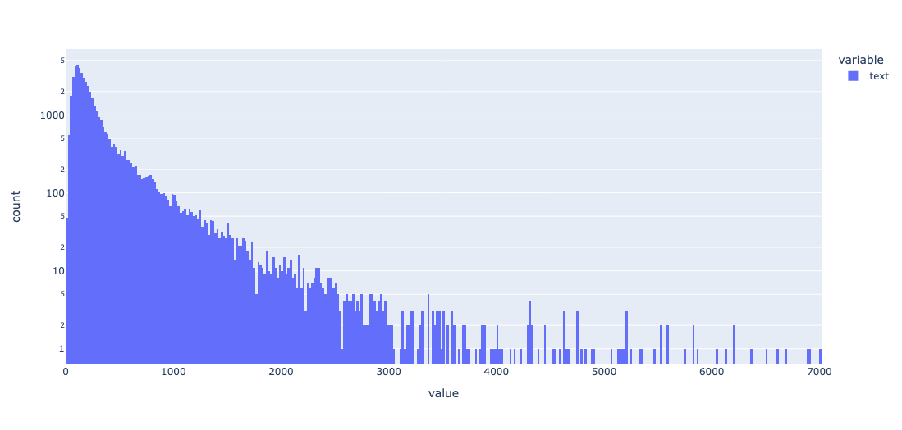
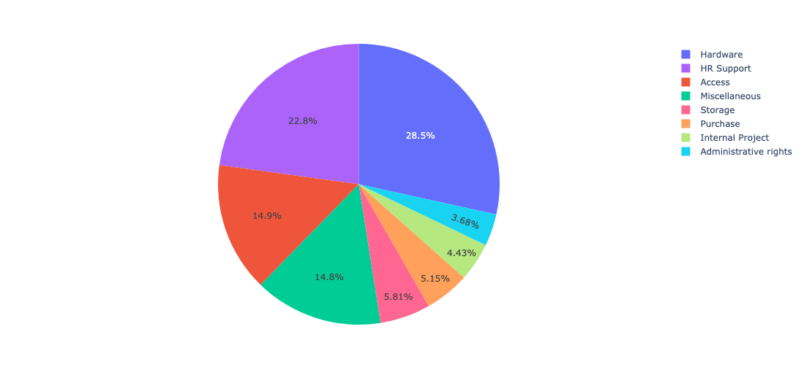
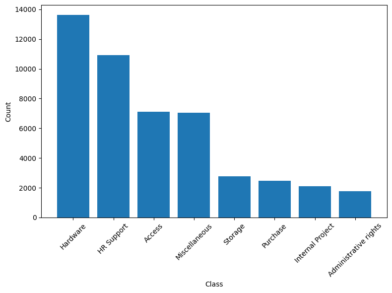
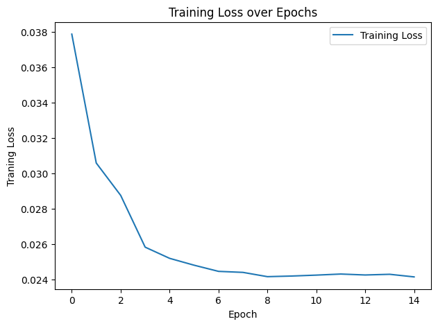
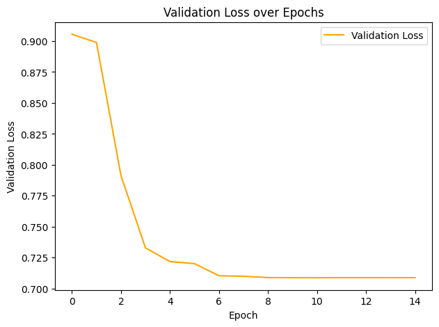
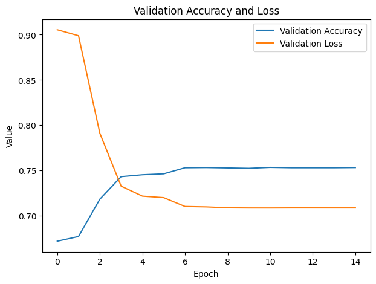

# IT Service Ticket Classification using DistilBERT

This project focuses on classifying IT service tickets into predefined categories using a DistilBERT model. The dataset comprises IT service tickets labeled with various categories, and the goal is to train a machine learning model to accurately classify new tickets.

## Table of Contents
- [Dataset](#dataset)
- [Dependencies](#dependencies)
- [Model Architecture](#model-architecture)
- [Training](#training)
- [Evaluation](#evaluation)
- [Results](#results)
- [License](#license)

## Dataset

The dataset contains 47,837 IT service tickets with two columns:

- **text**: The content of the IT service ticket.
- **label**: The category to which the ticket belongs.

The categories include:
- `Hardware`
- `HR Support`
- `Access`
- `Miscellaneous`
- `Storage`
- `Purchase`
- `Internal Project`
- `Administrative rights`

**Text Length**:

**Label Distribution**:

The dataset is split into:

- **Training Set**: 80% of the data
- **Validation Set**: 10% of the data
- **Test Set**: 10% of the data

## Dependencies

- Python 3.9.10
- PyTorch
- Hugging Face Transformers
- Scikit-learn
- Pandas
- Matplotlib
- Plotly

## Model Architecture
We use the pre-trained DistilBERT model as a feature extractor, followed by a custom classifier.

Custom Classifier
The classifier is composed of:

- A fully connected layer with 512 units followed by ReLU activation and 30% dropout.
- Another fully connected layer with 256 units followed by ReLU activation and 30% dropout.
- A final fully connected layer with num_classes output units for classification.

## Training
The model is trained for 15 epochs using the AdamW optimizer with a learning rate of 1e-3 and a step learning rate scheduler. The training loop calculates both training and validation losses and tracks the validation accuracy at each epoch.

## Evaluation
The trained model is evaluated on the test set, achieving an accuracy of 74.73%.

## Results
- **Final Test Accuracy**: 74.73%
- **Training Loss**: Decreases over epochs, indicating good model convergence. 
- **Validation Loss**: Monitored to prevent overfitting. 
- **Validation Accuracy**: Consistent and close to training accuracy, indicating good generalization. 

## License
This project is licensed under the MIT License. See the LICENSE file for details.

